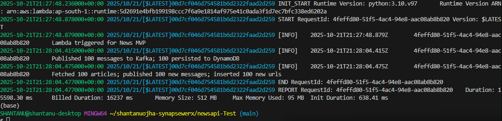
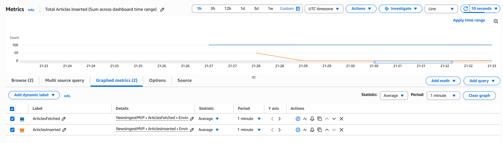
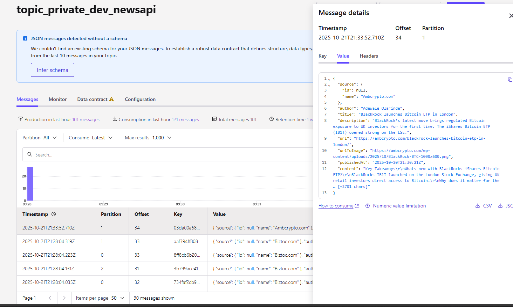
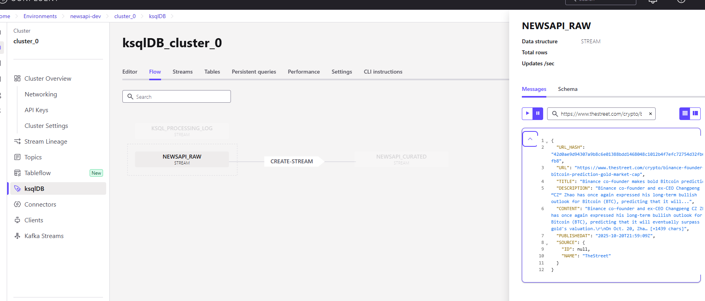
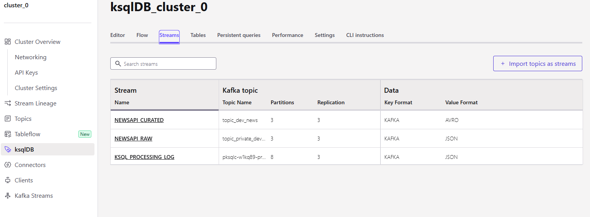
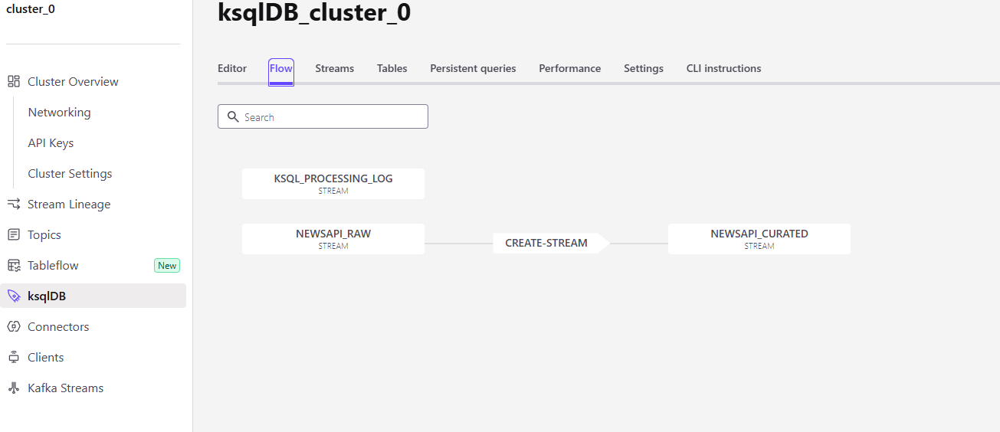
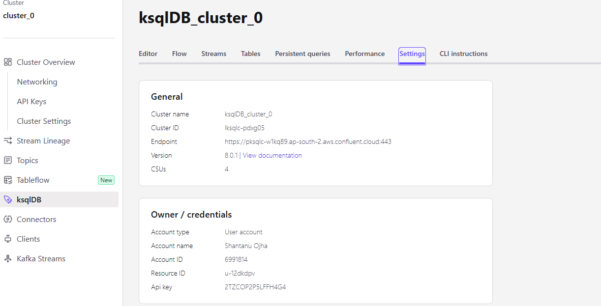
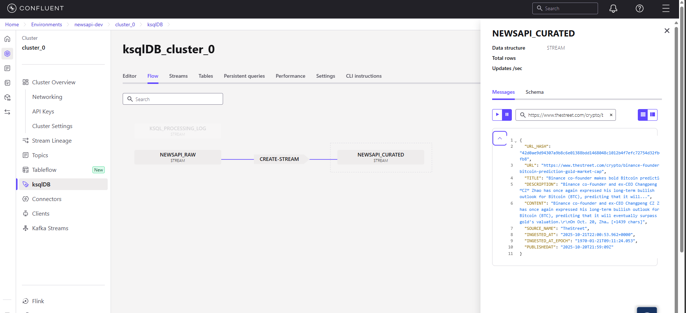
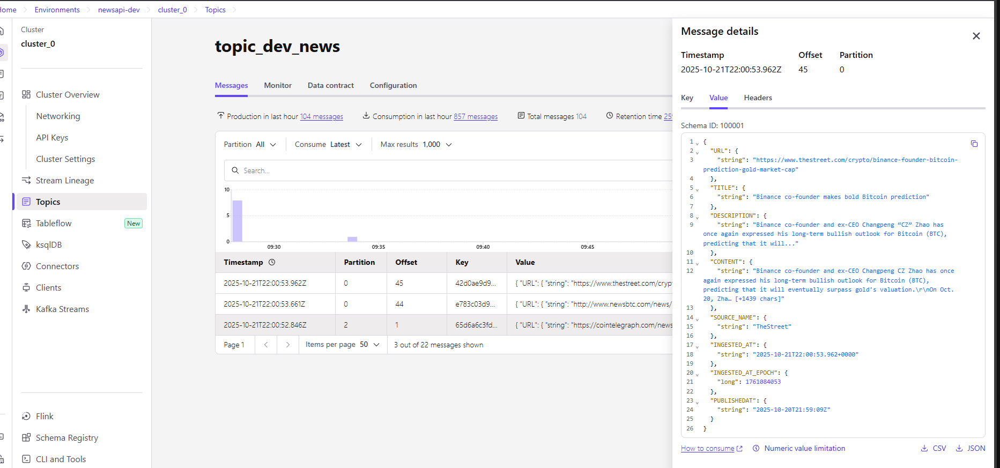

# newsapi-Test
A demo of the NewsAPI → Kafka ingestion pipeline with Terraform-managed AWS and Confluent resources.

## Solution Overview
- Fetches paginated NewsAPI articles every minute, normalises fields, and publishes one JSON message per record to the raw Kafka topic using the article URL hash as the key.
- Tracks ingestion progress with DynamoDB so replays only emit unseen URLs while maintaining chronological order.
- Applies ksqlDB transformations to derive a curated AVRO topic without modifying the raw payload in Lambda.
- Stores NewsAPI/Kafka credentials in Secrets Manager and pushes CloudWatch metrics for ingestion visibility.
- Uses Terraform to create the AWS footprint plus optional Confluent topics and ksqlDB statements, backed by a hardened S3 state bucket.

## Component Breakdown

### Lambda ingestion (`lambda/newsapi_ingest.py`)
- `fetch_all_news` paginates NewsAPI with retry-aware HTTP logic and honours `totalResults`, `PAGE_SIZE`, and `MAX_PAGES` limits.
- `normalise_article_schema` guarantees every record contains the expected NewsAPI keys (including nested `source.id/name`) before publishing.
- Uses SHA-256 URL hashes both for the Kafka message key and DynamoDB checkpoint ID so the same article is never processed twice.
- Emits `ArticlesFetched` and `ArticlesInserted` metrics to CloudWatch, keeping ingestion visibility in the AWS console alongside structured logging.

### Scheduling and observability (`terraform/main/lambda.tf`)
- An EventBridge rule (`aws_cloudwatch_event_rule.every_minute`) invokes the ingest Lambda every minute via `aws_cloudwatch_event_target`, ensuring near-real-time pulls without manual triggers.
- `aws_lambda_permission.allow_events` grants EventBridge permission to call the function, completing the managed schedule wiring.

### Progress checkpointing (`terraform/main/dynamodb.tf`)
- PAY_PER_REQUEST DynamoDB table stores `{id=url_hash, url, inserted_at}` items, keeping ingestion idempotent without manual capacity tuning.
- IAM policy in `terraform/main/iam.tf` grants Lambda the minimal rights required for logs, DynamoDB, Secrets Manager, and CloudWatch metrics.

### Kafka & ksqlDB (`terraform/main/confluent_topics.tf`, `terraform/main/ksqldb.tf`, `ksqldb/newsapi.sql.tpl`)
- Terraform can create raw and curated Confluent Cloud topics with configurable partitions, retention, and cleanup policies.
- ksqlDB SQL template establishes a JSON raw stream and projects a curated AVRO stream, renaming fields and filtering null values.
- A `null_resource` posts the rendered SQL to the ksqlDB REST API, validates command responses, and only replays when the payload changes.

### Secrets management (`terraform/main/secrets.tf`)
- Defines empty placeholder versions so Secrets Manager entries exist before values are uploaded, keeping sensitive payloads out of state.
- Local `null_resource` uploader reads `terraform/.secrets.json` and updates only populated keys, auto-detecting a compatible Bash path on Windows.

### Terraform structure & state security
- `terraform/bootstrap/backend_bucket.tf` creates the remote-state S3 bucket with public access blocked, AES-256 encryption, versioning, and a restrictive IAM policy scoped to the Terraform user.
- The main stack (`terraform/main/*`) assumes that backend, parameterises Confluent credentials, and wires Lambda, EventBridge, DynamoDB, Secrets, and topics together.
- `.terraform/`, lock files, generated binaries, ZIP artefacts, and state files are ignored via `.gitignore` to prevent leaking local state.

### Testing (`tests/test_newsapi_ingest.py`)
- Seven `unittest` cases cover schema preservation (including the provided Biztoc sample), pagination short-circuiting, Kafka publish success/error paths, DynamoDB lookups, and hash determinism.
- Runs locally with `python -m unittest discover -s tests`; a single "Failed to serialise" log line is expected from the negative Kafka path.

## Repository Layout
```
.
├── .gitignore
├── LICENSE
├── README.md
├── ksqldb
│   └── newsapi.sql.tpl
├── lambda
│   ├── newsapi_ingest.py
│   └── requirements.lock
├── terraform
│   ├── bootstrap
│   │   └── backend_bucket.tf
│   └── main
│       ├── backend.tf
│       ├── confluent_topics.tf
│       ├── dynamodb.tf
│       ├── iam.tf
│       ├── ksqldb.tf
│       ├── lambda.tf
│       ├── outputs.tf
│       ├── provider.tf
│       ├── secrets.tf
│       └── variables.tf
└── tests
  └── test_newsapi_ingest.py
```

## Deployment Workflow

Before running Terraform, copy the provided templates and populate them with your credentials:
```bash
cp terraform/.secrets.example.json terraform/.secrets.json
cp terraform/main/dev.auto.tfvars.example terraform/main/dev.auto.tfvars
# then edit both files with your NewsAPI, Confluent, and region-specific values
```

### 1. Bootstrap the Terraform state bucket (one-time)
```bash
cd terraform/bootstrap
export AWS_ACCESS_KEY_ID=YOUR_ACCESS_KEY
export AWS_SECRET_ACCESS_KEY=YOUR_SECRET_KEY
export AWS_DEFAULT_REGION=ap-south-1
terraform init
terraform apply -auto-approve
cd ../..
```
This stack creates the hardened S3 bucket consumed by `backend.tf` and outputs the bucket name/ARN for auditing.

### 2. Build the Lambda package
From the repo root:
```bash
rm -rf build
MSYS_NO_PATHCONV=1 docker run --rm \
  -v "$(pwd -W):/workspace" \
  -w /workspace \
  --entrypoint /bin/bash \
  public.ecr.aws/lambda/python:3.10 \
  -c 'pip install --upgrade pip && pip install --no-cache-dir -r lambda/requirements.lock -t build'
cp lambda/newsapi_ingest.py build/
cd build
zip -r ../terraform/newsapi_ingest.zip .
cd ..
cd terraform/main
terraform apply -auto-approve
cd ../..
```
After rebuilding the ZIP, re-run `terraform apply` (step 3) to redeploy the function.

### 3. Apply the main Terraform stack
```bash
cd terraform/main
export AWS_ACCESS_KEY_ID=YOUR_ACCESS_KEY
export AWS_SECRET_ACCESS_KEY=YOUR_SECRET_KEY
export AWS_DEFAULT_REGION=ap-south-1
terraform init
terraform apply
```
Provide sensitive inputs via `TF_VAR_…` environment variables or a local `.tfvars` file kept outside version control (e.g. Confluent keys, NewsAPI key, ksqlDB credentials).

### Tear-down workflow
```bash
cd terraform/main
terraform destroy -auto-approve

# Remove Secrets Manager entries so future applies start clean
aws secretsmanager delete-secret --secret-id news-mvp_newsapi_dev --force-delete-without-recovery
aws secretsmanager delete-secret --secret-id news-mvp_kafka_dev --force-delete-without-recovery

cd ../bootstrap
terraform destroy -auto-approve
```
Destroy the main stack first, forcibly delete the secrets, then remove the bootstrap state bucket.

## Secrets Manager gotcha
If you delete the `news-mvp_*` secrets and immediately rerun Terraform, AWS Secrets Manager keeps the same names in a “scheduled for deletion” state for up to seven days. Terraform can’t recreate them until the hold expires. To unblock quickly, either restore or purge them:
```bash
# Option 1: restore the scheduled-for-deletion secrets
aws secretsmanager restore-secret --secret-id news-mvp_newsapi_dev
aws secretsmanager restore-secret --secret-id news-mvp_kafka_dev

# Option 2: permanently delete so Terraform can recreate (destructive)
aws secretsmanager delete-secret --secret-id news-mvp_newsapi_dev --force-delete-without-recovery
aws secretsmanager delete-secret --secret-id news-mvp_kafka_dev --force-delete-without-recovery

# If you restored, import them into state so Terraform stops trying to recreate
terraform import aws_secretsmanager_secret.newsapi news-mvp_newsapi_dev
terraform import aws_secretsmanager_secret.kafka   news-mvp_kafka_dev
```
Pick the approach that matches what you need—restoring keeps the data, force deletion wipes it.

## View Lambda Logs
CloudWatch logs can be tailed with the AWS CLI.
- PowerShell / CMD:
  ```powershell
  aws logs tail /aws/lambda/newsapi_ingest_dev
  ```
- Git Bash / MSYS (disable path conversion):
  ```bash
  MSYS_NO_PATHCONV=1 aws logs tail /aws/lambda/newsapi_ingest_dev
  ```

Example output:



### CloudWatch Metrics
Custom metrics track how many articles were fetched from NewsAPI and successfully published to Kafka. Both metrics are emitted per invocation under the `NewsIngestMVP` namespace, with the `Environment` dimension.



## Kafka Topics
The raw topic (`topic_private_dev_newsapi`) receives one JSON payload per NewsAPI article with all keys preserved. Confluent Cloud UI screenshot below shows deduped messages and the payload details:



Message inspector confirming the SHA-256 hash is forwarded as the Kafka message key:



## ksqlDB Streams
The ksqlDB cluster materialises the raw stream and produces a curated AVRO stream for downstream consumers:



Flow view highlighting how NEWSAPI_RAW feeds the curated stream:



Cluster settings snapshot (endpoint, version, CSUs) for reference when configuring Terraform variables:



Curated stream inspector showing the same hash-based key on the AVRO topic:



Latest Schema Registry evolution confirming the curated AVRO schema includes the propagated key:



## Run Unit Tests
```powershell
python -m unittest discover -s tests
```
Expect one log line about serialisation failure; the test intentionally exercises the error branch.

## Pros & Cons

**Pros**
- Automated AWS footprint with remote-state hardening (encrypted/versioned S3 bucket) and least-privilege IAM.
- Deterministic ingestion pipeline: DynamoDB checkpoints, SHA-256 message keys, and metric-backed visibility.
- Raw JSON payloads stay unmodified; curated AVRO schema evolves centrally in ksqlDB.
- Local unit tests cover core logic without cloud access, supporting fast iterations.
- Even if Kafka experiences processing delays, dedupe logic prevents duplicate records because we only persist checkpoints after a successful publish.
- DynamoDB state is updated only after Kafka publish succeeds, ensuring retries cannot mark incomplete work as done.

**Cons / Shortcomings**
- NewsAPI developer tier only returns 10 articles per call and supports 50 requests every 12 hours, limiting how much history we can ingest despite the pagination logic.
- Kafka cluster and ksqlDB were provisioned through the Confluent Cloud UI due to time constraints; Terraform currently assumes those resources already exist.

## Conclusion
The project delivers the specified ingestion pipeline end to end: Lambda ingests NewsAPI data on a minutely EventBridge schedule, publishes one message per article to Kafka, and uses DynamoDB checkpoints to guarantee deduped retries. Terraform provisions the AWS footprint, including hardened remote state, IAM, Secrets Manager, DynamoDB, and scheduling. Beyond the core requirements, we layered in CloudWatch custom metrics, detailed logging, and unit tests to validate schema normalisation and publisher behaviour. The only manual step remaining is the Confluent-side provisioning, which can be automated later if desired.
